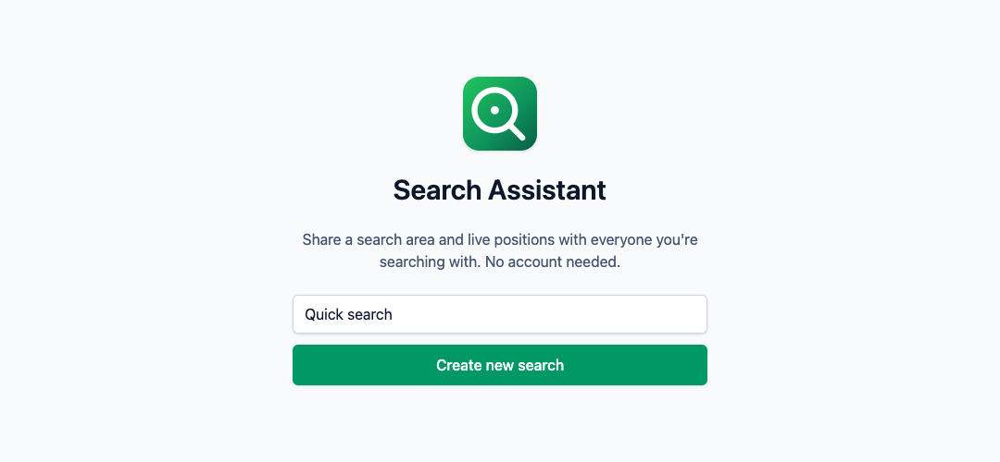
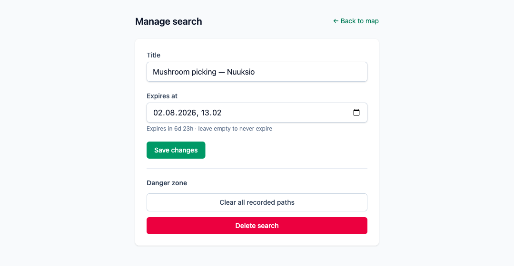
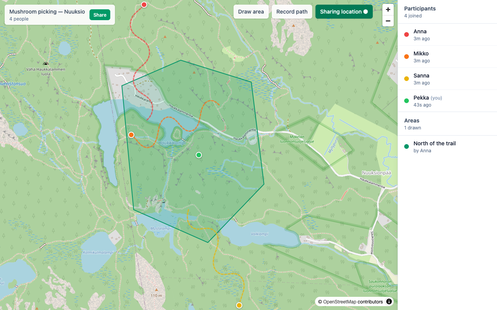
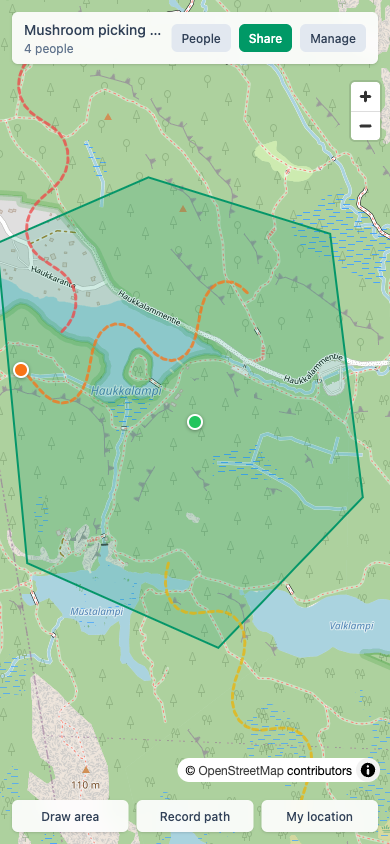

<p align="center">
  
</p>

<h1 align="center">Search Assistant</h1>

<p align="center">
  Collaborative GPS + map search assistant. Share a link, everyone sees the
  same search area, walked paths, and live positions.
  <br />
  <strong><a href="https://searchassistant.eport.fi/">searchassistant.eport.fi</a></strong>
</p>

## Screenshots

|  |  |
|---|---|
|  |  |
| Create a search — no account, no signup. | The creator can rename it, change expiry, clear paths, or delete it. |



*A live search: the drawn search area, everyone's walked paths, and where they are right now.*

<p align="center">
  
</p>

*On phones the actions move to a bottom bar and the sidebar becomes a "People" sheet.*

## How it works

Built for casual group activities — mushroom picking, group hikes,
geocaching — where everyone just needs to see who has covered which ground.

- **Anonymous, link-based.** Creating a search returns a
  `https://searchassistant.eport.fi/s/{slug}` link. Anyone who opens it picks
  a display name and joins. No accounts, no email, no app install required.
- **Shared search area.** Any participant can draw a polygon on the map;
  it appears for everyone within a second.
- **Live positions.** While "Sharing location" is on, your position streams
  over SignalR to everyone else in the same search (throttled to ~1/s on the
  client and ~700ms server-side).
- **Walked paths.** Recording a path stores your track as a LineString,
  simplified server-side with Douglas–Peucker, so the group can see the
  ground already covered. Exportable as GPX from the share sheet.
- **Two tokens, no user table.** A *session token* identifies a participant
  (drawing areas, recording paths, sending positions); an *owner token*,
  returned when the search is created, unlocks the manage page. Both live in
  `localStorage` (`UserDefaults`/`SharedPreferences` on native).
- **Self-expiring.** Searches expire 7 days after creation by default;
  participants, areas, paths, and positions cascade-delete with them.

Everything geographic is stored as PostGIS `geography(_, 4326)` with GIST
indexes. `AGENT.md` has the full architecture: repo layout, data model,
realtime event contract, auth filters, and deployment topology.

## Local development

```sh
# 1. Start the database
docker compose -f compose.dev.yml up -d

# 2. Run the API (port 5080)
ASPNETCORE_ENVIRONMENT=Development \
  dotnet run --project apps/api/SearchAssistant.Api --urls=http://localhost:5080

# 3. Run the web app (port 5173)
cd apps/web && npm install && npm run dev
```

Migrations apply automatically on API startup. The Vite dev server must run
on port 5173 — that is the only origin the API's dev CORS policy allows.

## Native apps

`apps/ios/` (SwiftUI + MapKit) and `apps/android/` (Jetpack Compose + Google
Maps) are standalone clients of the same REST + SignalR API, and they open
`/s/{slug}` links directly via universal links / app links. Both point at
production by default — for local work against `localhost:5080`, change
`apps/ios/SearchAssistant/Services/Config.swift` or
`apps/android/app/src/main/java/fi/eport/searchassistant/AppConfig.kt`.

### iOS

Deployment target is iOS 16. The `.xcodeproj` is **not checked in** —
[xcodegen](https://github.com/yonaskolb/XcodeGen) regenerates it from
`project.yml`, so re-run it whenever that file changes:

```sh
brew install xcodegen          # one-time
cd apps/ios && xcodegen
open SearchAssistant.xcodeproj # then pick a simulator and ⌘R
```

Headless build check (no signing needed):

```sh
xcodebuild -project apps/ios/SearchAssistant.xcodeproj -scheme SearchAssistant \
           -sdk iphonesimulator -configuration Debug CODE_SIGNING_ALLOWED=NO build
```

Signing uses team `HEJK7U967E` / bundle ID `fi.eport.searchassistant`, with
`applinks:searchassistant.eport.fi` as the associated domain. The launcher
icon is drawn in code rather than hand-authored: running
`swift apps/ios/scripts/make-app-icon.swift` re-renders
`AppIcon.appiconset/AppIcon-1024.png` deterministically. More detail in
[`apps/ios/README.md`](apps/ios/README.md).

### Android

Requires JDK 21 (Gradle toolchain), compileSdk 36, minSdk 26. A Google Maps
SDK key is **required** for the map to render in any build:

```sh
cd apps/android
cp local.properties.sample local.properties   # then add MAPS_API_KEY=AIzaSy...
./gradlew installDebug                        # build + install on a device/emulator
```

Other common targets:

```sh
./gradlew assembleDebug     # APK  → app/build/outputs/apk/
./gradlew bundleRelease     # AAB  → app/build/outputs/bundle/
./gradlew lint
```

`bundleRelease` signs with `app/release.keystore` when it exists (passwords
come from `local.properties`) and falls back to the debug keystore otherwise.
A new signing key needs its SHA-256 fingerprint added to
`AndroidCertFingerprints` in
`apps/api/SearchAssistant.Api/Endpoints/WellKnownEndpoints.cs` and the API
redeployed, or App Links stop verifying. Full walkthrough in
[`apps/android/README.md`](apps/android/README.md).

## Stack

- Backend: .NET 10 + ASP.NET Core minimal APIs + EF Core + NetTopologySuite, SignalR for realtime
- Database: Postgres 16 + PostGIS 3
- Frontend: Vue 3 + Vite + TypeScript + Pinia + MapLibre GL JS + terra-draw + Tailwind v4
- Mobile: native iOS (SwiftUI/MapKit) and Android (Compose/Google Maps)
- Hosting: Docker Compose on a single VM, behind nginx-proxy-manager

## Publishing

```sh
./docker-publish.sh
```

Builds `searchassistant-api` and `searchassistant-web` for `linux/amd64`,
tags them as `docker-repository.eport.fi/searchassistant-{api,web}:latest`,
and pushes. Override the target API URL baked into the SPA with
`VITE_API_BASE=https://your-host ./docker-publish.sh`.

## License

MIT — see [LICENSE](./LICENSE).
